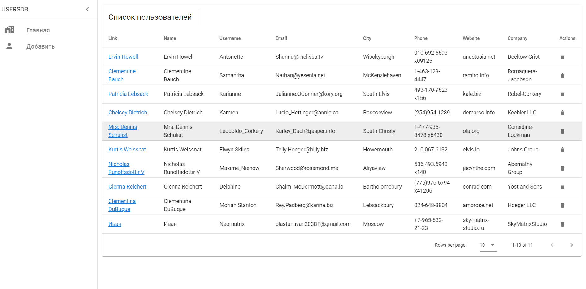
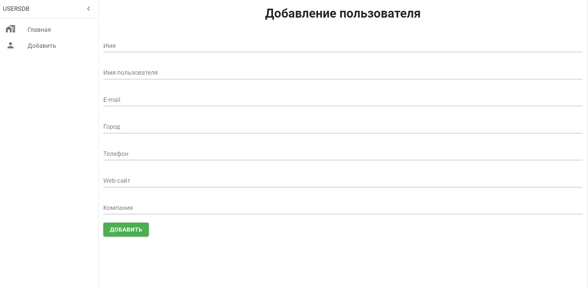
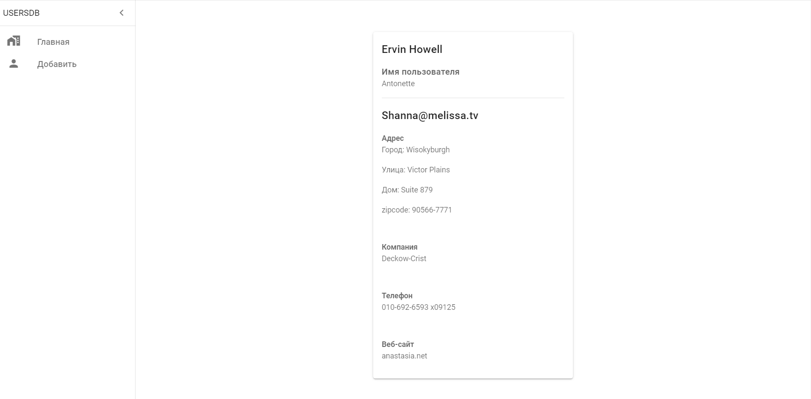

# db-users

## Тестовое задание.

Реализовать список пользователей с поиском по имени. С возможностью удаления/добавления пользователя. И переходом на подробную страницу о пользователе.
Удаление и добавление не должно работать через REST.

---
Реализованы страницы:
* Главная со списком пользователей
* Страница с формой добавления нового пользователя
* Страница с подробной информацией о пользователе

Добавлена валидация полей формы при добавлении нового пользователя.






## Установка

```
  git clone 
```

```
  npm install
```

### Компиляция и hot-reloads для режима разработки
```
  npm run serve
```

### Компиляция и минификация для production
```
npm run build
```

### Линтинг
```
 npm run lint
```
